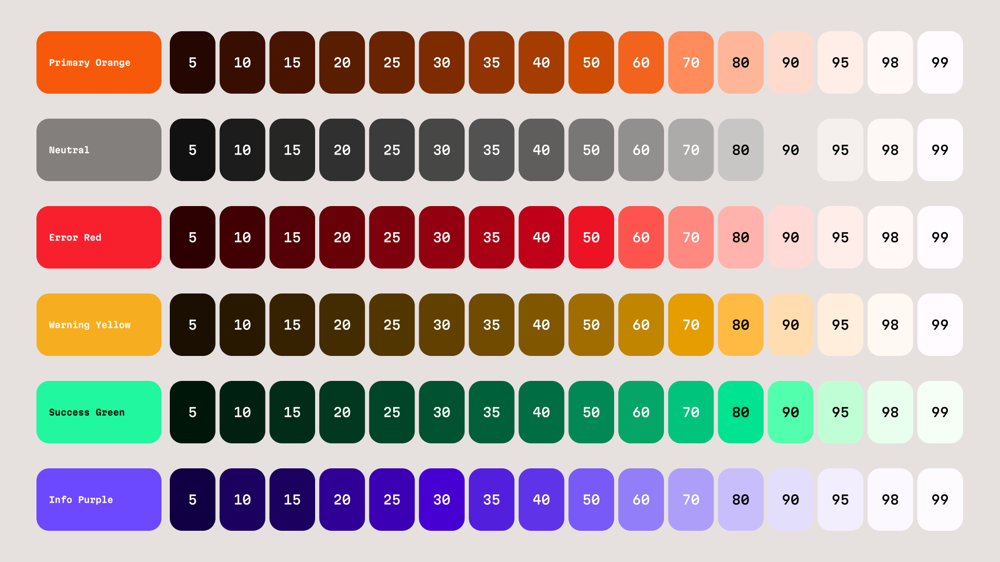

# Caldera-Bridge-Theme-Generator
A Figma plugin to generate themes for the Caldera Bridge using Google's HCT color system.


HCT is a color space that Google has produced to help them build dynamically changing UI. Katmai Design System uses this color space to make sure that what ever color a user provides we can automatically generate a UI that has visual clarity, contrast, and hits accessibility standards.

## Features
- Generate a color palette from a single primary color or an image
- Define fonts
- Define corner radius
- Toggle features such as backgrounds
- Derive color roles from HCT Palatte
- Export color roles and palatte to a .json file


## Installation

### Prerequisites
- Node.js (version 14 or higher)
- npm
- Figma desktop app

### Development Setup
1. Clone this repository:
   ```bash
   git clone <repository-url>
   cd Birdge\ Theme\ Creator
   ```

2. Install dependencies:
   ```bash
   npm install
   ```

3. Build the plugin:
   ```bash
   npm run build
   ```

### Installing in Figma
1. Open the Figma desktop app
2. Go to **Plugins** → **Development** → **Import plugin from manifest...**
3. Navigate to this project folder and select the `manifest.json` file
4. The plugin will now appear in your **Plugins** → **Development** menu

### Development Mode
For active development, you can use the watch mode to automatically rebuild when files change:
```bash
npm run watch
```

After making changes, refresh the plugin in Figma by going to **Plugins** → **Development** → **Hot reload plugin**.

## Color Palette


### Primary Palette

When building a color palette we need at the very least a Brand/Primary color, which we can derive from a img or just a hex code. From there we can break down the the color in a palette.

With the Primary base color, we then break down the palette using HCT tones. We can then can convert the HCT values to something useable, such as RGBA or HEX.

### Neutral Palette

We derive the neutral color by taking the HSL of the selected brand color and lowering the saturation (The "S" in HSL) to 2%.  We then apply the same technique to get the shades for the primary color palette. The difference for the neutral palette is we need a few more shade options between 91-94, 96-99 so we get more shades. 

Neutral shades are broken down by its light value in the HSL.


## Color Roles
Color roles are defined in the Katmai Design System and used on the Caldera Bridge along with the rest of Caldera products. Will provide more insight later. 


